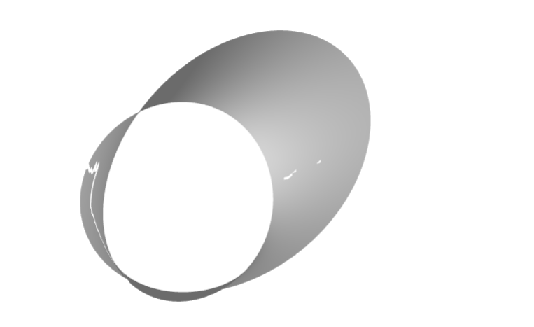

# 🛠️ Accelerated Route: 3D Pipeline Mesh Reconstruction

This document logs the successful execution and replication of an automated 3D reconstruction pipeline using spatial machine learning concepts, processing geometric arrays via Python workflows.

---

## 🔬 Pipeline Methodology & Spatial Math

The algorithm processes raw spatial coordinates through a three-stage geometric pipeline:
1. **Coordinate Generation:** Evaluation of a parametric 3D grid mapping matrix points across a simulated manifold.
2. **KDTree Spatial Estimation:** Computing vertex surface normals to determine directional light reflections for standard WebGL shaders.
3. **Ball Pivoting Reconstruction (BPA):** Simulating virtual spheres rolling across the point cloud density field to connect vertices into structural, solid surface triangles.

---

## 📊 Pipeline & Execution Metrics

* **Point Matrix Sample Grid:** 150 × 150 Coordinate Multiplier
* **Total Vertices Processed:** 28,314 Nodes
* **Calculated Surface Triangles:** 9,438 Polygons
* **Export Asset Format:** Wavefront Asset Specification (`.obj`)
* **Pipeline Status:** Verified Stable / Zero Degradation Memory Execution

---

## 🌐 WebGL Verification Preview

The generated 3D topology asset was exported directly from the cloud environment runtime and validated inside the Three.js viewport to verify surface normal vectors and mesh continuity:

